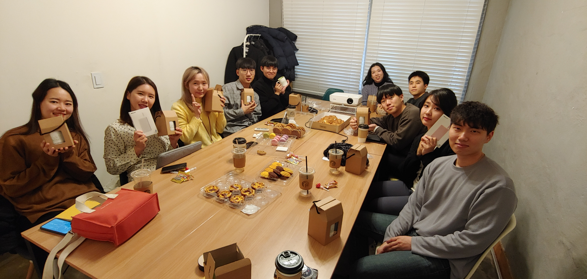
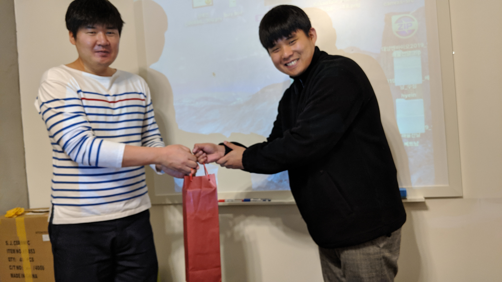
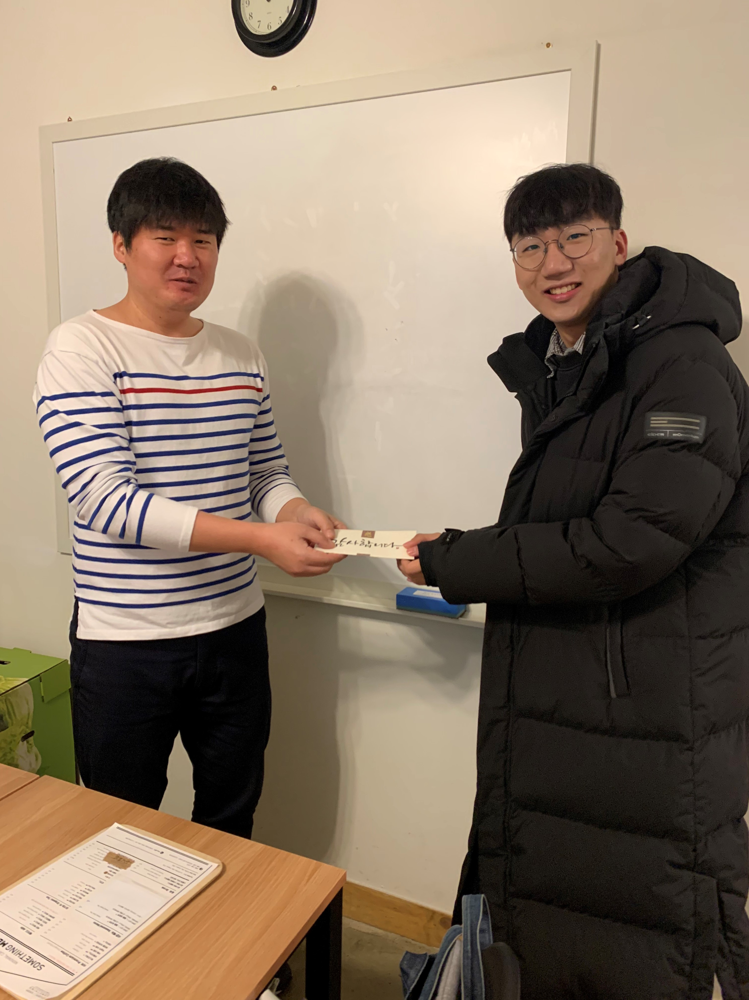
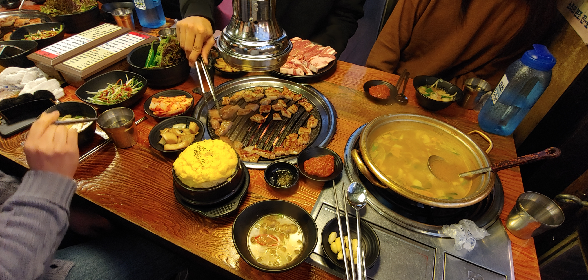
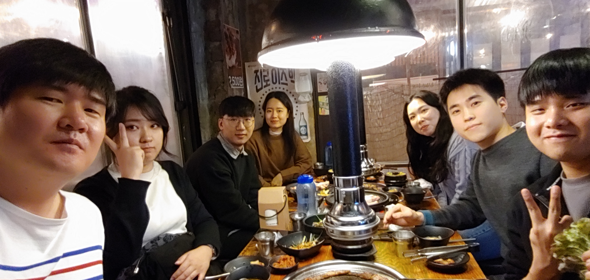

# HomeComingDay2019 review

## Overview

제가 멘토링 해 드렸던 분 중에 참석 가능한 분을 한 자리에 모아 그 동안 하고 싶었던 얘기도 하고 프로젝트 발표, 기술 발표 등 좋은 자리였던 것 같습니다.
다시 한번 참석해 주신 여러분께 감사 드립니다.

## 준비

여러분들에게 어떤 기념이 될 만한 선물을 준비하는게 좋을 지 많이 고민했습니다.
견과류, 수건, 티셔츠 등 많은 후보를 제치고 머그컵을 골랐습니다.
Github contribution 이미지를 컵에 넣으면 볼 떄 마다 열심히 해야 겠다는 생각이 들 것 같아서 만들었어요.

발표자 선물도 고민 많이 했는데 휴대용 배터리가 실용성이 있을 것 같아서 조금 값이 나가는 고속 충전이 되는 모델로 골랐어요.

## 모임

다들 서로 모르는 상태에서 어색할텐데도 중간에 도망가지 않고 끝까지 있어 주셔서 감사합니다.
여러분들은 그래도 저를 오랫동안 봐 왔고 알고 있으니까 그런 거라고 생각했습니다.
준비한 과자와 빵도 많이 준비했는데 다 먹지는 못해서 가져가고 싶으신 분 나눠드리고 해서 좋았던 것 같습니다.

## 발표

발표자 분들이 준비를 잘 해오셨고, 의외로 대충 만들어오거나 금방 끝나지 않아서 너무 좋았습니다.
제 예상시간을 훌쩍 넘긴 시간이었지만 좋은 분위기에서 발표가 잘 진행되서 다행입니다.
제가 생각했던 그런 분위기였어요. 서로 질문/답변이 자연스럽게 되고 밝은 분위기에서 진행된거 같습니다.
(물론 제가 알면서도 능청스럽게 물어본 질문은 제외)

## Special thanks

저는 모든 멘티분들을 다 기억하고 있습니다. 어느 누구 하나 빠지지 않고 다 소중하신 분들이니까요.
순서는 가나다순도 아니고, 멘토링 했던 시기 순서도 아닌 모임 때 앉았던 자리 순서대로입니다.

### 노혜림님

저는 혜림님이 모임에 참석하시겠다고 메일 주신게 매우 반가웠습니다. 오래되신 분들 중에 회신 주신 분이 별로 없었거든요.
1년 만에 다시 뵈서 반가웠고요, 아직도 2018년 하코사 세미나에서 제가 책 당첨된걸 그대로 드렸던 기억이 많이 남네요.
지금 하는 일이 재미가 없으시더라도, 뭔가 또 저와 해보고 싶은게 있으시다면 언제든 연락 주세요.

### 정혜인님

저는 혜인님이 부끄러움이 많으신 분인 줄 몰랐는데, 그 와중에도 발표를 잘 해 주셔서 고마웠습니다.
그리고 미처 제 노트북과 프로젝터를 연결할 케이블을 못가져왔는데도 흔쾌히 맥북을 내주셔서 감사합니다.

### 조윤우님

윤우님도 발표 준비하고 발표 하시느라 수고 많이 하셨습니다. 다들 나이 얘기할 때 놀라지 않으신 분이 없을 정도였긴 했는데
그래도 꾸준히 그리고 열심히 하시는 모습이 좋은 것 같습니다. 나이는 숫자일 뿐이에요.

### 이근주님

네이버 취업 되셨다고 하니 너무 잘 된거 같습니다. 제가 봤던 근주님은 뭔가 하나 제대로 꽂히면 파고드는 성격이셨던 것 같았거든요.
마지막 회식 때 근주님 모르는 분은 아마 없었을 거에요.  공대 연구실이 그런 분들만 있는 곳이었다뇨??

### 한인수님

인수님도 마찬가지로 취업 되셨다고 해서 뿌듯했어요. 제가 도와드린건 어느 정도 있지만 정말 그 프로젝트를 하고 완성한건 여러분이니까요.
취업해서 일하는 곳이 생각했던 곳이 아니라고 하더라도 거기 가서 배우는게 있을 겁니다.

### 고아라님

아라님의 고민은 충분히 이해가 됩니다. 한게 없는 것 같은데 졸업 한다고 그러면 마음 잡기가 쉽지 않을 거에요.
제가 아라님 얘기를 듣고 정말 도와드리고 싶다는 생각이 들었으니까요.
정말 뭔가 생각한걸 만들어 보고 싶다는 결정을 하고, 저랑 같이 할 생각 있으시면 꼭 연락주세요.

### 윤태원님

태원님이 제 멘티 중에는 현역인데다 가장 최근에 하신 분이라 참석하면 좋겠다고 생각했는데 역시 흔쾌히 참석해 주신다고 해서 감사합니다.
앞으로도 다른 개발 기술을 가지고 하고 싶다고 한게 있다고 했으니까요 그만한다고 할 떄 까지 봐드리겠습니다.

### 조승현님

승현님 이날 발표한 내용 보니까 정말 개발에 관심이 많고 하고 싶은게 많은 분이라는 걸 느꼈습니다. 한이음 멘토링 할 때도 안드로이드 앱 만들었다고 보여주실 떄 부터 느끼긴 했어요. 내년에도 또 만나게 되면 더 잘 할 수 있게 계획을 잘 세워서 진행했으면 좋겠습니다.

### 권영언님

영언님도 서버쪽 개발 하는 것에 관심이 많은 것으로 알고 있습니다. 승현님과 함께 참석해 주셔서 감사드리고요. 내년에도 더 잘할 수 있게 도움 드리겠습니다.

### 박원정님

원정님은 발표 자료를 너무 잘 만들어 오신 것도 그렇고, 새벽까지 작업을 하셨다는 것에 정말 수고하셨다는 얘기를 해 드리고 싶어요.
다들 ppt 애니매이션 퀄리티에 놀랐지만 저는 그 이후에 만들어온 애니매이션도 꽤 고퀄이라고 느끼고 있습니다.
원정님도 앞으로 쭉 좋은 신뢰관계를 유지해서 회사 생활도 잘 하셨으면 좋겠고, 새로 하겠다는 분야의 프로젝트도 언젠가 같이 했으면 좋겠네요.

### 장은실님

유일한 no show이신 분. 연락이라도 주시지 그러셨어요.

### 정재우님

재우님의 경우는 토요일에도 출근해서 일하시느라 정말 저한테 많이 미안해하셨는데 괜찮습니다.
회사 일이 바쁘면 어쩔 수 없는건 충분히 히해하니까요.
나중에라도 또 뵐일 있으면 뵜으면 좋겠습니다.

## Special thanks 2

### 한인수님, 이근주님

작년 한인수님과 이근주님에게 멘토링 해 드린게 기억에 많이 남는데 올해도 잊지 않고 찾아주셔서 감사합니다.
게다가 제 덕분에 취업해서 고맙다며 상품권과 와인 선물 해준신건 잊지 않을 선물인것 같습니다.
취업이 잘 되신건 제 덕이 아니라 여러분이 열심히 해서 얻은 결과입니다. 적어도 저는 그렇게 생각합니다.

### 조윤우님, 정혜인님

제가 참석자 선물박스 때문에 빵,과자 박스를 들 수가 없어서 모임 장소에 가는 길에 사시는 조윤우님에게 도움을 요청했는데요
흔쾌히 수락하시고 같이 짐 들어 주셔서 감사합니다. 일부러 주차장 까지 와서 기다렸다가 같이 가주신 정혜인님에게도 감사드려요.

## 뒷풀이 회식

저녁 식시도 원하는 분들에 한해서 진행됐는데 다들 초면인데도 즐겁게 얘기해서 좋았습니다.
상수역 바로 앞에 있는 국제식당에서 고기를 3Kg이나 먹었는데 배불러서 남기기 까지 했네요. 
나중에 또 모임이 있다면 어떤 좋은 아이디어로 했으면 좋겠는지에 대한 얘기도 했었고 근주님의 연구실 nerd 이야기가 제일 재밌었어요.
마지막 압권은 자랑하는 걸 즐기는 공대생의 모습이겠죠? 저도 뜻밖의 커밍아웃이었긴 했지만요.

## 더 할얘기는 issues에 적어주세요.

- 모임 관련 아이디어: 선물, 기획, 장소 등
- 각자 느꼈던 후기
- 저한테 혹은 다른 분들에게 할 이야기
- 그냥 뭔가 쓰고 싶다면
- https://github.com/jongfeel/HomeComingDay2019/issues